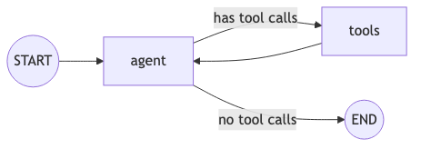

# Tutorial 100: Async LangGraph Agent

This tutorial demonstrates how to build an **asynchronous** LangGraph agent on AgentEx with:
- Task-based event handling via Redis
- Tool calling (ReAct pattern)
- Multi-turn conversation memory via AgentEx checkpointer
- Tracing integration

## Graph Structure



## Sync vs Async: Key Differences

| Aspect | Sync (Tutorial 030) | Async (This Tutorial) |
|--------|--------------------|-----------------------|
| **ACP Type** | `sync` | `async` |
| **Handler** | `@acp.on_message_send` | `@acp.on_task_event_send` |
| **Response** | HTTP streaming (yields) | Redis streaming |
| **Message Echo** | Implicit | Explicit (`adk.messages.create`) |
| **Streaming Helper** | `convert_langgraph_to_agentex_events()` | `stream_langgraph_events()` |
| **Extra Handlers** | None | `on_task_create`, `on_task_cancel` |

### When to use Async?
- Long-running tasks that may exceed HTTP timeout
- Agents that need to push updates asynchronously
- Multi-step workflows where the client polls for results
- Production agents that need reliable message delivery via Redis

## Files

| File | Description |
|------|-------------|
| `project/acp.py` | ACP server with async event handlers |
| `project/graph.py` | LangGraph state graph definition |
| `project/tools.py` | Tool definitions (weather example) |
| `tests/test_agent.py` | Integration tests |
| `manifest.yaml` | Agent configuration |

## Running Locally

```bash
# From this directory
agentex agents run
```

## Running Tests

```bash
pytest tests/test_agent.py -v
```
