# AgentEx Tutorials

Progressive tutorials for learning AgentEx from basics to production-ready patterns.

## Prerequisites

**Before starting any tutorial:**
1. Set up your development environment following the [main repo README](https://github.com/scaleapi/scale-agentex#setup)
2. Start backend services from repository root:
   ```bash
   cd /path/to/agentex-python
   make dev
   ```
3. Verify Temporal UI is accessible at http://localhost:8233

For troubleshooting, see the [AgentEx debugging guide](https://github.com/scaleapi/scale-agentex#troubleshooting).

## Learning Path

```mermaid
graph TD
    A[👋 Start Here] --> B[00_sync/000_hello_acp]
    B --> C[00_sync/010_multiturn]
    C --> D[00_sync/020_streaming]

    D --> E{Need Task<br/>Management?}
    E -->|Yes| F[10_agentic/00_base/<br/>000_hello_acp]
    E -->|No| G[Continue with<br/>sync patterns]

    F --> H[00_base/010_multiturn]
    H --> I[00_base/020_streaming]
    I --> J[00_base/030_tracing]
    J --> K[00_base/040_other_sdks]
    K --> L[00_base/080_batch_events]

    L --> M{Building for<br/>Production?}
    M -->|Yes| N[10_temporal/<br/>000_hello_acp]
    M -->|No| O[00_base/090_multi_agent]

    N --> P[10_temporal/010_agent_chat]
    P --> Q[10_temporal/020_state_machine]
    Q --> R[10_temporal/030_custom_activities]
    R --> S[10_temporal/050_guardrails]

    S --> T{Using<br/>OpenAI SDK?}
    T -->|Yes| U[10_temporal/060_openai_hello]
    U --> V[10_temporal/070_openai_tools]
    V --> W[10_temporal/080_openai_hitl]
    T -->|No| X[🎉 Production Ready!]
    W --> X

    style A fill:#e1f5e1
    style X fill:#fff3cd
    style E fill:#e3f2fd
    style M fill:#e3f2fd
    style T fill:#e3f2fd
```



## Tutorial Structure

### 00_sync/ - Synchronous Agents
Simple request-response patterns without task management. Start here if you're new to AgentEx.

- **[000_hello_acp](00_sync/000_hello_acp/)** - Your first agent
- **[010_multiturn](00_sync/010_multiturn/)** - Maintaining conversation context
- **[020_streaming](00_sync/020_streaming/)** - Real-time response streaming

**When to use:** Simple chatbots, stateless Q&A, quick prototypes

---

### 10_agentic/ - Task-Based Agents

#### 00_base/ - Non-Temporal Patterns
Task-based architecture without workflow orchestration. Adds task management on top of sync patterns.

- **[000_hello_acp](10_agentic/00_base/000_hello_acp/)** - Task-based hello world
- **[010_multiturn](10_agentic/00_base/010_multiturn/)** - Multiturn with task management
- **[020_streaming](10_agentic/00_base/020_streaming/)** - Streaming with tasks
- **[030_tracing](10_agentic/00_base/030_tracing/)** - Observability with Scale Groundplane
- **[040_other_sdks](10_agentic/00_base/040_other_sdks/)** - Integrating OpenAI, Anthropic, etc.
- **[080_batch_events](10_agentic/00_base/080_batch_events/)** - Event batching (shows limitations → Temporal)
- **[090_multi_agent_non_temporal](10_agentic/00_base/090_multi_agent_non_temporal/)** - Complex multi-agent coordination

**When to use:** Task tracking needed but workflows are simple, no durability requirements

---

#### 10_temporal/ - Production Workflows
Durable, fault-tolerant agents with Temporal workflow orchestration.

**Core Patterns:**
- **[000_hello_acp](10_agentic/10_temporal/000_hello_acp/)** - Temporal basics
- **[010_agent_chat](10_agentic/10_temporal/010_agent_chat/)** - Stateful conversations
- **[020_state_machine](10_agentic/10_temporal/020_state_machine/)** - Structured state management
- **[030_custom_activities](10_agentic/10_temporal/030_custom_activities/)** - Custom Temporal activities
- **[050_agent_chat_guardrails](10_agentic/10_temporal/050_agent_chat_guardrails/)** - Safety & validation

**OpenAI Agents SDK Series:**
- **[060_openai_hello_world](10_agentic/10_temporal/060_open_ai_agents_sdk_hello_world/)** - Plugin-based agents
- **[070_openai_tools](10_agentic/10_temporal/070_open_ai_agents_sdk_tools/)** - Tool integration patterns
- **[080_openai_hitl](10_agentic/10_temporal/080_open_ai_agents_sdk_human_in_the_loop/)** - Human oversight workflows

**When to use:** Production systems requiring durability, fault tolerance, long-running workflows, or complex state management

---

## Quick Start

```bash
# 1. Start backend services (from repo root)
make dev

# 2. Navigate to a tutorial
cd examples/tutorials/00_sync/000_hello_acp

# 3. Run it
uv run python hello_acp.py
```

## Common Commands

```bash
# Format tutorial code (always scope to specific files you're modifying)
rye run format examples/tutorials/00_sync/000_hello_acp/

# Run all agentic tutorial tests
cd examples/tutorials
./run_all_agentic_tests.sh

# Run specific tutorial test
cd examples/tutorials
uv run pytest 00_sync/000_hello_acp/ -v

# Check Temporal UI (when running temporal tutorials)
open http://localhost:8233
```

## Tutorial Categories at a Glance

| Category | Tutorials | Focus | Use When |
|----------|-----------|-------|----------|
| **Sync** | 3 | Request-response basics | Learning fundamentals, simple chatbots |
| **Agentic Base** | 7 | Task management without workflows | Need task tracking, simple coordination |
| **Temporal** | 8 | Production-grade workflows | Need durability, fault tolerance, complex state |

## Getting Help

- **Each tutorial includes:** README explaining concepts, annotated source code, and tests
- **Common issues?** See [AgentEx troubleshooting guide](https://github.com/scaleapi/scale-agentex#troubleshooting)
- **Need more context?** Check the [main AgentEx documentation](https://github.com/scaleapi/scale-agentex)

---

**Ready to start?** → Begin with [00_sync/000_hello_acp](00_sync/000_hello_acp/)
